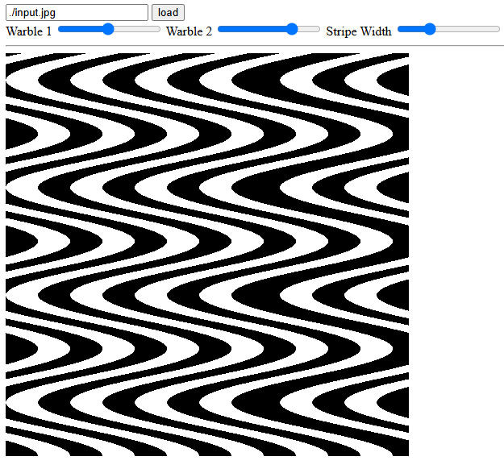

# warbler

"Warbler" is a warbley art generator, implemented as a simple vanilla JavaScript web UI.

## Usage

Host on a web server, eg. for local use try the following:

```
python3 -m http.server
http://localhost:8000/
```

The UI looks something like the following:



Tweak the sliders to taste. Many browsers will provide the option to save the result by right-clicking on the image.

## Advanced Usage

For now many parameters can only be changed by modifying the code. You can add, remove, and reorder transforms by looking for `let transforms` at the top of `main.js` but beware of the ugly hack in `onChangeWarble` for now that will clobber those changes.

You can also modify the resolution of the generated image. Be aware that the UI canvas dimensions are different from the resolution of the underlying bitmap, eg. look for `canvas.style.width` and `canvas.style.height`.
